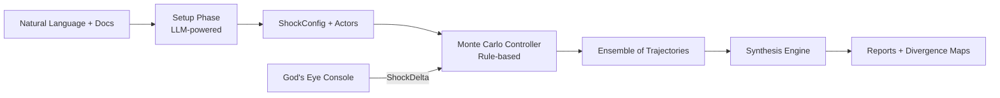
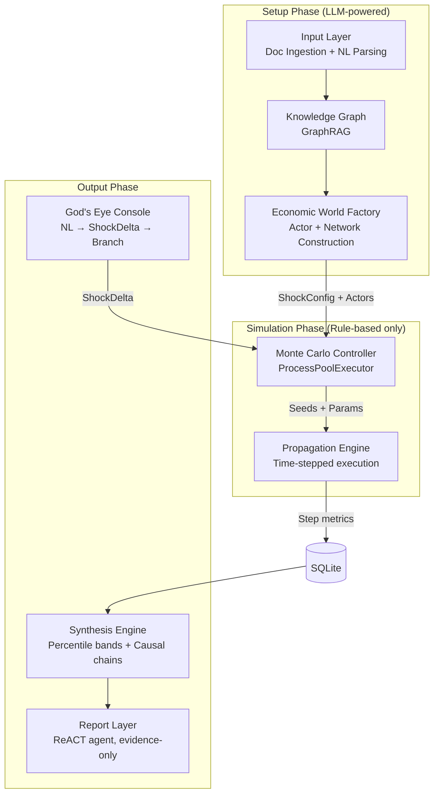

# Design Document: Clyde Economic Simulator

## Overview

Clyde is a situation-agnostic economic simulator. You describe an economic event in plain English, it builds a world of actors and connections, runs hundreds of Monte Carlo simulations with pure rule-based logic, and gives you distributional outcomes with causal explanations.

The key architectural insight: LLM is expensive and non-deterministic. So we use it **only once** during setup (parsing scenarios, building actors, constructing the knowledge graph). The actual simulation loop is 100% rule-based — no LLM calls. This makes 100–500 Monte Carlo runs feasible on commodity hardware.

### High-Level Flow



### Design Principles

- **LLM boundary is hard**: Setup phase uses LLM. Simulation phase never does. Enforced at the architecture level.
- **Deterministic reproducibility**: Every run gets a seed. Same seed = same trajectory.
- **Evidence-only reporting**: Every claim in a report traces back to simulation data. No LLM hallucination in outputs.
- **Branch = re-simulate**: Interventions fork from step 0 with merged config, not mutation of running state.
- **Situation-agnostic**: No hardcoded scenario types. The actor/network/behavior system adapts to any economic situation.

## Architecture

The system is organized into six subsystems connected in a pipeline. Each subsystem has a clear boundary and communicates through well-defined data structures.



### Subsystem Responsibilities

| Subsystem | Phase | Responsibility |
|-----------|-------|---------------|
| Input Layer | Setup (LLM) | PDF/MD/TXT ingestion, NL scenario parsing, ambiguity flagging |
| Knowledge Graph | Setup (LLM) | Economic ontology graph from documents, entity/relationship extraction |
| Economic World Factory | Setup (LLM) | ShockConfig extraction, actor spawning, behavioral param assignment, network wiring |
| Monte Carlo Controller | Simulation (Rules) | Parallel run orchestration, deterministic seeding, branch management |
| Propagation Engine | Simulation (Rules) | Time-stepped actor updates in fixed order, metric computation |
| Synthesis Engine | Output | Percentile band aggregation, divergence maps, causal chain detection |
| Report Layer | Output (LLM) | ReACT agent generating evidence-backed narrative reports |
| God's Eye Console | Output (LLM) | NL → ShockDelta parsing, branch forking |

### LLM Boundary Enforcement

The simulation phase is isolated from LLM access at the module level. The `PropagationEngine` and `MonteCarloController` classes have no imports from any LLM client library. This is enforced by:

1. **Module-level separation**: Simulation code lives in `clyde/simulation/` which has no LLM dependencies in its `__init__.py` or any submodule.
2. **Type boundary**: The handoff between setup and simulation is a fully-resolved `ShockConfig` + list of `Actor` objects with all behavioral parameters set. No lazy LLM calls.
3. **CI check**: A lint rule that fails if any import from `clyde/llm/` appears in `clyde/simulation/`.

## Components and Interfaces

### 1. Input Layer

```python
class ScenarioParser:
    """Parses natural language + documents into structured scenario specs."""
    
    async def parse(self, 
                    description: str, 
                    documents: list[Document] | None = None
                    ) -> ParseResult:
        """
        Extract scenario specification from natural language.
        Returns ParseResult with extracted params + ambiguities.
        """
        ...
    
    async def resolve_ambiguities(self, 
                                   parse_result: ParseResult, 
                                   resolutions: dict[str, str]
                                   ) -> ParseResult:
        """Incorporate user resolutions into the parse result."""
        ...

class DocumentIngester:
    """Handles PDF/MD/TXT → raw text extraction."""
    
    def ingest(self, file_path: Path) -> Document:
        """Extract text content from a document file."""
        ...
    
    def supported_formats(self) -> set[str]:
        """Returns {'pdf', 'md', 'txt'}."""
        ...

@dataclass
class ParseResult:
    triggering_event: str
    geographies: list[str]
    markets: list[str]
    shock_params: ShockParams
    time_horizon: TimeHorizon
    ambiguities: list[Ambiguity]
    actor_hints: list[ActorHint]

@dataclass
class Ambiguity:
    field: str
    description: str
    options: list[str] | None
    resolved: bool = False
    resolution: str | None = None
```

### 2. Knowledge Graph

```python
class KnowledgeGraph:
    """GraphRAG-based economic ontology store."""
    
    def build_from_documents(self, documents: list[Document], 
                              parse_result: ParseResult) -> None:
        """Build graph from ingested documents using economic ontology."""
        ...
    
    def extract_shock_config(self) -> ShockConfig:
        """Extract structured ShockConfig from the graph."""
        ...
    
    def query(self, query: str) -> list[GraphNode]:
        """Query the graph for entities/relationships."""
        ...
    
    def merge_sources(self, nl_entities: list[Entity], 
                       doc_entities: list[Entity]) -> list[Conflict]:
        """Merge NL-derived and document-derived entities, return conflicts."""
        ...

    def store_simulation_artifact(self, artifact: SimulationArtifact) -> None:
        """Store simulation results back into the graph for reporting."""
        ...
```

### 3. Economic World Factory

```python
class EconomicWorldFactory:
    """Constructs the simulation world from ShockConfig."""
    
    def build_world(self, 
                    shock_config: ShockConfig, 
                    prior_library: PriorLibrary,
                    param_overrides: dict[str, Any] | None = None
                    ) -> SimulationWorld:
        """
        Spawn actors, assign behaviors from prior library,
        wire network topology. Returns a fully resolved world
        ready for simulation (no LLM needed after this).
        """
        ...

class PriorLibrary:
    """Versioned, citable behavioral parameter store."""
    
    def get_params(self, actor_type: ActorType, 
                    context: ScenarioContext) -> BehaviorParams:
        """Look up empirical behavioral parameters for an actor type."""
        ...
    
    def version(self) -> str:
        """Current library version."""
        ...
    
    def citation(self, param_name: str) -> Citation:
        """Get the source citation for a specific parameter."""
        ...

class NetworkBuilder:
    """Constructs the three network structures."""
    
    def build_labor_market(self, households: list[Household], 
                            firms: list[Firm]) -> BipartiteGraph:
        """Bipartite matching: households ↔ firms."""
        ...
    
    def build_supply_chain(self, firms: list[Firm], 
                            households: list[Household]) -> DirectedGraph:
        """Directed graph: firms → firms, firms → households."""
        ...
    
    def build_interbank(self, banks: list[Bank]) -> ScaleFreeGraph:
        """Scale-free network: banks ↔ banks."""
        ...
```

### 4. Monte Carlo Controller

```python
class MonteCarloController:
    """Orchestrates parallel ensemble simulation runs."""
    
    def run_ensemble(self, 
                     world: SimulationWorld, 
                     run_count: int = 200,
                     max_workers: int | None = None
                     ) -> EnsembleResult:
        """
        Execute run_count simulations in parallel using ProcessPoolExecutor.
        Each run gets a deterministic seed derived from the ensemble seed.
        """
        ...
    
    def fork_branch(self, 
                    base_config: ShockConfig, 
                    delta: ShockDelta,
                    run_count: int = 200
                    ) -> BranchResult:
        """
        Create a branch by merging ShockDelta into ShockConfig
        and re-simulating from step 0. NOT mutation of running state.
        """
        ...
    
    def _generate_seeds(self, ensemble_seed: int, 
                         run_count: int) -> list[int]:
        """Deterministic seed generation from master seed."""
        ...

    def _run_single(self, world: SimulationWorld, 
                     seed: int, run_id: str) -> TrajectoryResult:
        """Execute one simulation run with the given seed."""
        ...
```

### 5. Propagation Engine

```python
class PropagationEngine:
    """Time-stepped rule-based simulation execution."""
    
    def run(self, world: SimulationWorld, seed: int, 
            run_id: str, db: SimulationDB) -> TrajectoryResult:
        """
        Step through time horizon. At each step, update actors
        in fixed order, compute metrics, persist to DB.
        """
        ...
    
    def _step(self, world: SimulationWorld, step: int, 
              rng: Random) -> StepMetrics:
        """
        Execute one time step. Actor update order:
        1. Central Bank → policy rate decision
        2. Banks → credit tightening, interbank borrowing
        3. Firms → investment, hiring/firing, pricing, bankruptcy check
        4. Labor Market → matching/clearing
        5. Households → consumption, savings, wage demands, credit seeking
        6. Interbank Network → settlement, freeze detection
        7. Bankruptcies → removal + cascade
        8. Learning → Bayesian belief updates
        9. Metrics → compute all core metrics
        """
        ...
```

### 6. Synthesis Engine

```python
class SynthesisEngine:
    """Extracts distributional outputs from ensemble results."""
    
    def compute_paths(self, ensemble: EnsembleResult) -> PathBundle:
        """
        Compute percentile bands:
        - Central: p50
        - Optimistic: p75–p90
        - Pessimistic: p10–p25
        - Tail: beyond p90 or below p10
        """
        ...
    
    def compute_divergence_map(self, 
                                ensemble: EnsembleResult) -> DivergenceMap:
        """Identify variables that most determine which outcome branch occurs."""
        ...
    
    def detect_causal_chains(self, 
                              ensemble: EnsembleResult) -> list[CausalChain]:
        """Extract ordered actor-to-actor shock transmission sequences."""
        ...
    
    def select_metrics(self, scenario: Scenario, 
                        ensemble: EnsembleResult) -> list[MetricSelection]:
        """Pick situation-relevant metrics from the fixed output palette."""
        ...
```

### 7. Report Layer

```python
class ReportAgent:
    """ReACT agent that generates evidence-only narrative reports."""
    
    async def generate_report(self, 
                               synthesis: SynthesisResult,
                               db: SimulationDB
                               ) -> NarrativeReport:
        """
        Generate narrative report using ReACT loop.
        Every factual claim must trace to a simulation artifact.
        LLM is used for language generation, NOT for factual content.
        """
        ...

@dataclass
class NarrativeReport:
    sections: list[ReportSection]
    provenance: list[ProvenanceAnnotation]

@dataclass
class ProvenanceAnnotation:
    claim: str
    source_type: str  # "simulation_db" | "knowledge_graph"
    source_ref: str   # specific artifact ID
    query_used: str   # the query that retrieved the evidence
```

### 8. God's Eye Console

```python
class GodsEyeConsole:
    """Natural language intervention interface."""
    
    async def parse_injection(self, 
                               injection_text: str,
                               base_scenario: Scenario
                               ) -> ShockDelta:
        """Parse NL intervention into structured ShockDelta."""
        ...
    
    def apply_delta(self, 
                    base_config: ShockConfig, 
                    delta: ShockDelta) -> ShockConfig:
        """Merge ShockDelta into base ShockConfig for re-simulation."""
        ...
```

## Data Models

### Core Domain Objects

```python
@dataclass
class ShockConfig:
    """Complete specification for initializing a simulation."""
    shock_type: str
    severity: float          # 0.0–1.0 normalized
    scope: str               # "micro" | "sectoral" | "macro" | "cross_border"
    duration_steps: int
    geography: list[str]
    sectors: list[str]
    initial_contact_actors: list[str]  # actor IDs first touched by shock
    agent_counts: dict[str, int]       # {"household": 1000, "firm": 200, ...}
    behavioral_overrides: dict[str, Any]
    time_horizon: TimeHorizon
    ensemble_seed: int
    historical_analogs: list[HistoricalAnalog]

@dataclass
class TimeHorizon:
    steps: int
    step_unit: str  # "day" | "week" | "month" | "quarter"

@dataclass
class ShockDelta:
    """Intervention override for branch creation."""
    intervention_step: int
    param_overrides: dict[str, Any]
    new_events: list[str]
    description: str  # original NL description
    
@dataclass
class SimulationWorld:
    """Fully resolved world ready for simulation. No LLM needed."""
    config: ShockConfig
    actors: list[Actor]
    networks: NetworkBundle
    prior_library_version: str
```

### Actor Models

```python
class ActorType(Enum):
    HOUSEHOLD = "household"
    FIRM = "firm"
    BANK = "bank"
    CENTRAL_BANK = "central_bank"

@dataclass
class Actor:
    """Base actor with type-specific state and behavior params."""
    id: str
    actor_type: ActorType
    state: dict[str, float]      # mutable per-step state
    params: BehaviorParams       # fixed at init, varies across MC runs
    relationships: list[Relationship]

@dataclass
class Relationship:
    source_id: str
    target_id: str
    rel_type: str  # "employment" | "lending" | "trade" | "supply" | "interbank"
    weight: float
```

### Household State & Params

```python
@dataclass
class HouseholdState:
    income: float
    savings: float
    consumption: float
    employed: bool
    employer_id: str | None
    debt: float
    inflation_expectation: float  # Bayesian updated
    confidence: float

@dataclass
class HouseholdParams:
    mpc: float                    # marginal propensity to consume
    precautionary_savings_rate: float
    unemployment_fear_threshold: float
    wage_demand_elasticity: float
    inflation_expectation_prior: float
    inflation_expectation_lr: float  # Bayesian learning rate
    credit_seek_threshold: float
```

### Firm State & Params

```python
@dataclass
class FirmState:
    revenue: float
    costs: float
    inventory: float
    employees: list[str]          # household IDs
    price_level: float
    investment: float
    debt: float
    demand_pressure: float
    is_bankrupt: bool
    suppliers: list[str]          # firm IDs

@dataclass
class FirmParams:
    hurdle_rate: float
    hiring_elasticity: float
    firing_threshold: float
    cost_push_weight: float       # pricing: cost-push factor
    demand_pull_weight: float     # pricing: demand-pull factor
    supplier_switch_stress: float # threshold to switch suppliers
    bankruptcy_threshold: float   # debt/revenue ratio trigger
    investment_sensitivity: float
```

### Bank State & Params

```python
@dataclass
class BankState:
    reserves: float
    loans_outstanding: float
    npl_ratio: float              # non-performing loan ratio
    credit_tightness: float       # 0=loose, 1=tight
    interbank_borrowed: float
    is_stressed: bool

@dataclass
class BankParams:
    npl_tightening_elasticity: float
    herding_weight: float         # how much peer behavior matters
    reserve_threshold: float      # below this → seek interbank
    credit_approval_floor: float  # minimum borrower score
    risk_appetite: float
```

### Central Bank State & Params

```python
@dataclass
class CentralBankState:
    policy_rate: float
    inflation_target: float
    output_gap_estimate: float

@dataclass
class CentralBankParams:
    taylor_inflation_weight: float
    taylor_output_weight: float
    rate_increment: float         # 25bps = 0.0025
    discretionary_band: float     # allowed deviation from Taylor rule
    neutral_rate: float
```

### Network Structures

```python
@dataclass
class NetworkBundle:
    labor_market: BipartiteGraph    # households ↔ firms
    supply_chain: DirectedGraph     # firms → firms, firms → households
    interbank: ScaleFreeGraph       # banks ↔ banks

@dataclass
class BipartiteGraph:
    edges: list[tuple[str, str, float]]  # (household_id, firm_id, weight)

@dataclass
class DirectedGraph:
    edges: list[tuple[str, str, float]]  # (source_id, target_id, weight)

@dataclass
class ScaleFreeGraph:
    edges: list[tuple[str, str, float]]  # (bank_id, bank_id, weight)
```

### Metrics & Results

```python
@dataclass
class StepMetrics:
    """Core metrics computed every simulation step."""
    step: int
    gdp_index: float
    inflation_rate: float
    unemployment_rate: float
    gini_coefficient: float
    credit_tightening_index: float
    firm_bankruptcy_count: int
    bank_stress_index: float
    consumer_confidence: float
    interbank_freeze: bool
    custom_metrics: dict[str, float]  # situation-specific extras

@dataclass
class TrajectoryResult:
    run_id: str
    seed: int
    steps: list[StepMetrics]
    causal_events: list[CausalEvent]
    final_state: SimulationWorld

@dataclass
class EnsembleResult:
    scenario_id: str
    config: ShockConfig
    trajectories: list[TrajectoryResult]
    run_count: int
    ensemble_seed: int

@dataclass
class PathBundle:
    central: list[StepMetrics]      # p50
    optimistic: list[StepMetrics]   # p75–p90
    pessimistic: list[StepMetrics]  # p10–p25
    tail_upper: list[StepMetrics]   # >p90
    tail_lower: list[StepMetrics]   # <p10
```

### Causal Chain Model

```python
@dataclass
class CausalEvent:
    """Single link in a causal chain."""
    step: int
    source_actor_id: str
    target_actor_id: str
    channel: str          # relationship type used
    variable_affected: str
    magnitude: float
    description: str

@dataclass
class CausalChain:
    """Ordered sequence of actor-to-actor shock transmissions."""
    chain_id: str
    events: list[CausalEvent]
    origin_shock: str
    total_magnitude: float
    
    def serialize(self) -> dict:
        """Serialize to JSON-compatible dict."""
        ...
    
    @classmethod
    def deserialize(cls, data: dict) -> "CausalChain":
        """Parse from JSON-compatible dict."""
        ...
```

### Scenario Serialization

```python
@dataclass
class Scenario:
    """Complete simulation specification — serializable."""
    scenario_id: str
    description: str
    config: ShockConfig
    actors: list[Actor]
    networks: NetworkBundle
    prior_library_version: str
    overrides: dict[str, Any]
    metadata: dict[str, Any]
    
    def serialize(self) -> dict:
        """Serialize to JSON-compatible dict."""
        ...
    
    @classmethod
    def deserialize(cls, data: dict) -> "Scenario":
        """Parse from JSON-compatible dict."""
        ...
    
    def pretty_print(self) -> str:
        """Human-readable representation."""
        ...
```

### Persistence (SQLite Schema)

```sql
-- Runs table: one row per simulation run
CREATE TABLE runs (
    run_id TEXT PRIMARY KEY,
    scenario_id TEXT NOT NULL,
    branch_id TEXT,
    seed INTEGER NOT NULL,
    config_json TEXT NOT NULL,
    status TEXT NOT NULL,  -- 'running' | 'completed' | 'failed'
    created_at TIMESTAMP DEFAULT CURRENT_TIMESTAMP
);

-- Step metrics: one row per step per run
CREATE TABLE step_metrics (
    run_id TEXT NOT NULL,
    step INTEGER NOT NULL,
    gdp_index REAL,
    inflation_rate REAL,
    unemployment_rate REAL,
    gini_coefficient REAL,
    credit_tightening_index REAL,
    firm_bankruptcy_count INTEGER,
    bank_stress_index REAL,
    consumer_confidence REAL,
    interbank_freeze INTEGER,  -- boolean as 0/1
    custom_metrics_json TEXT,
    PRIMARY KEY (run_id, step),
    FOREIGN KEY (run_id) REFERENCES runs(run_id)
);

-- Causal events: shock propagation log
CREATE TABLE causal_events (
    event_id INTEGER PRIMARY KEY AUTOINCREMENT,
    run_id TEXT NOT NULL,
    step INTEGER NOT NULL,
    source_actor_id TEXT NOT NULL,
    target_actor_id TEXT NOT NULL,
    channel TEXT NOT NULL,
    variable_affected TEXT NOT NULL,
    magnitude REAL NOT NULL,
    description TEXT,
    FOREIGN KEY (run_id) REFERENCES runs(run_id)
);

-- Branches: tracks branch relationships
CREATE TABLE branches (
    branch_id TEXT PRIMARY KEY,
    parent_scenario_id TEXT NOT NULL,
    shock_delta_json TEXT NOT NULL,
    merged_config_json TEXT NOT NULL,
    created_at TIMESTAMP DEFAULT CURRENT_TIMESTAMP
);

-- Backtest results
CREATE TABLE backtest_results (
    backtest_id TEXT PRIMARY KEY,
    scenario_id TEXT NOT NULL,
    historical_event TEXT NOT NULL,
    actual_outcome_json TEXT NOT NULL,
    simulated_distribution_json TEXT NOT NULL,
    accuracy_score REAL,
    created_at TIMESTAMP DEFAULT CURRENT_TIMESTAMP
);
```

### Divergence Map & Reporting Models

```python
@dataclass
class DivergenceMap:
    """Variables that most determine which outcome branch occurs."""
    variables: list[DivergenceVariable]

@dataclass
class DivergenceVariable:
    name: str
    sensitivity: float        # how much outcome changes per unit change
    current_uncertainty: float
    monitoring_indicator: str  # real-world indicator to watch

@dataclass
class HistoricalAnalog:
    event_name: str
    year: int
    similarity_score: float
    param_adjustments: dict[str, float]
    source: str  # citation

@dataclass
class Citation:
    title: str
    authors: list[str]
    year: int
    source: str  # journal/institution
    url: str | None
```

## Correctness Properties

*A property is a characteristic or behavior that should hold true across all valid executions of a system — essentially, a formal statement about what the system should do. Properties serve as the bridge between human-readable specifications and machine-verifiable correctness guarantees.*

### Property 1: Ambiguity Resolution Merge

*For any* `ParseResult` with one or more ambiguities and *for any* valid set of user resolutions covering those ambiguities, resolving the ambiguities SHALL produce a `ParseResult` where every resolved field contains the user-supplied value and the corresponding ambiguity is marked as resolved.

**Validates: Requirements 1.3**

### Property 2: Network Integrity

*For any* constructed `SimulationWorld`, every `Relationship` SHALL reference valid actor IDs (both `source_id` and `target_id` exist in the world's actor list), and every relationship's `rel_type` SHALL be a member of the defined set: {employment, lending, trade, supply, ownership, regulation, trust}.

**Validates: Requirements 2.3, 2.4**

### Property 3: Network Topology Constraints

*For any* constructed `SimulationWorld`:
- The labor market network SHALL be bipartite: edges connect only households to firms, never same-type actors.
- The supply chain network SHALL be directed: edges go from firms to firms or firms to households, never from households.
- The interbank network SHALL contain only bank-to-bank edges.

**Validates: Requirements 2.5, 2.6, 2.7**

### Property 4: Actor Behavioral Completeness

*For any* actor produced by the `EconomicWorldFactory`, the actor SHALL have all behavioral parameters required for its type fully populated (non-null) at construction time:
- Household: mpc, precautionary_savings_rate, unemployment_fear_threshold, wage_demand_elasticity, inflation_expectation_prior, inflation_expectation_lr, credit_seek_threshold
- Firm: hurdle_rate, hiring_elasticity, firing_threshold, cost_push_weight, demand_pull_weight, supplier_switch_stress, bankruptcy_threshold, investment_sensitivity
- Bank: npl_tightening_elasticity, herding_weight, reserve_threshold, credit_approval_floor, risk_appetite
- Central Bank: taylor_inflation_weight, taylor_output_weight, rate_increment, discretionary_band, neutral_rate

**Validates: Requirements 3.1, 3.6, 3.7, 3.8, 3.9, 3.10, 4.1, 15.4**

### Property 5: Prior Library Citability

*For any* parameter in the `PriorLibrary`, the parameter SHALL have a non-empty version string and a `Citation` with non-empty title, authors, year, and source fields.

**Validates: Requirements 3.3**

### Property 6: Override Application

*For any* actor type, *for any* set of behavioral parameter overrides, and *for any* set of shock parameter overrides provided by the user, the resulting actor's params SHALL contain the override values (not the defaults), and the `Scenario` specification SHALL record all overrides with their sources.

**Validates: Requirements 3.4, 3.5, 4.3**

### Property 7: Simulation Step Count

*For any* `SimulationWorld` with a `TimeHorizon` of N steps, running the `PropagationEngine` SHALL produce a `TrajectoryResult` containing exactly N `StepMetrics` entries, numbered 0 through N-1.

**Validates: Requirements 5.1**

### Property 8: Ensemble Run Distinctness

*For any* ensemble of K runs, each run SHALL use a distinct seed, and the behavioral parameter sets across runs SHALL be pairwise distinct (no two runs share identical parameter configurations).

**Validates: Requirements 6.1, 6.3**

### Property 9: Ensemble Trajectory Count

*For any* ensemble run configured with `run_count = K`, the resulting `EnsembleResult` SHALL contain exactly K `TrajectoryResult` entries.

**Validates: Requirements 6.2**

### Property 10: Deterministic Reproducibility

*For any* `SimulationWorld` and *for any* seed, running the `PropagationEngine` twice with the same seed SHALL produce identical `TrajectoryResult` outputs (same metrics at every step, same causal events).

**Validates: Requirements 6.5**

### Property 11: Percentile Band Ordering

*For any* `EnsembleResult`, the `SynthesisEngine` SHALL produce paths where, at every time step and for every core metric: `tail_lower ≤ pessimistic ≤ central ≤ optimistic ≤ tail_upper` (using the appropriate directional comparison per metric).

**Validates: Requirements 7.1, 7.2, 7.3, 7.4**

### Property 12: Divergence Map Completeness and Watchlist Derivation

*For any* `EnsembleResult` with non-zero variance across trajectories, the `DivergenceMap` SHALL be non-empty, each `DivergenceVariable` SHALL have a positive sensitivity score and a non-empty monitoring indicator, and the indicator watchlist produced by the `SynthesisEngine` SHALL contain exactly the `monitoring_indicator` values from the `DivergenceMap`'s variables (no extras, no omissions).

**Validates: Requirements 7.5, 9.4**

### Property 13: Branch Re-simulation Integrity

*For any* `ShockConfig` and *for any* `ShockDelta` with a valid `intervention_step`, creating a branch SHALL produce a full re-simulation from step 0 where the merged config contains all original ShockConfig values plus all ShockDelta overrides, and the resulting trajectory has the full time horizon of steps.

**Validates: Requirements 8.1, 8.4, 8.7**

### Property 14: Report Provenance Completeness

*For any* generated `NarrativeReport`, every factual claim SHALL have a `ProvenanceAnnotation` with a non-null `source_type` (either "simulation_db" or "knowledge_graph"), a non-null `source_ref`, and a non-null `query_used`.

**Validates: Requirements 9.2, 9.6**

### Property 15: Causal Chain Ordering

*For any* detected `CausalChain`, the events within the chain SHALL be ordered by step number (non-decreasing), and each event SHALL reference valid actor IDs from the simulation.

**Validates: Requirements 9.3**

### Property 16: CausalChain Serialization Round-Trip

*For any* valid `CausalChain` object, `serialize(deserialize(serialize(chain)))` SHALL produce output identical to `serialize(chain)`.

**Validates: Requirements 13.1, 13.2, 13.3**

### Property 17: Scenario Serialization Round-Trip

*For any* valid `Scenario` object, `serialize(deserialize(serialize(scenario)))` SHALL produce output identical to `serialize(scenario)`.

**Validates: Requirements 14.1, 14.2, 14.3**

### Property 18: Core Metrics Completeness

*For any* simulation run, at every time step, the `StepMetrics` SHALL contain non-null values for all 9 core metrics (gdp_index, inflation_rate, unemployment_rate, gini_coefficient, credit_tightening_index, firm_bankruptcy_count, bank_stress_index, consumer_confidence, interbank_freeze). When custom metrics are configured, they SHALL also be present alongside the core set. All metrics SHALL be queryable per (run_id, step) from the simulation database.

**Validates: Requirements 17.1, 17.2, 17.3**

## Error Handling

### Input Layer Errors

| Error Condition | Handling |
|----------------|----------|
| Unsupported document format | Raise `UnsupportedFormatError` with the file extension. Only PDF/MD/TXT accepted. |
| Document extraction failure (corrupted PDF) | Raise `DocumentIngestionError` with file path and underlying cause. Skip document, continue with others if multiple provided. |
| Empty or nonsensical NL input | Return `ParseResult` with all fields as ambiguities flagged for user resolution. |
| LLM timeout during parsing | Retry up to 3 times with exponential backoff. If all fail, raise `ParsingTimeoutError`. |
| Conflicting NL + document entities | Flag conflicts in `KnowledgeGraph.merge_sources()` return value. Do not silently pick one. |
| Knowledge Graph build failure (malformed ontology or empty documents) | Raise `KnowledgeGraphBuildError` with details on which documents/entities failed. Partial graph is preserved if some documents succeeded. |

### Simulation Errors

| Error Condition | Handling |
|----------------|----------|
| Actor references non-existent relationship target | Raise `NetworkIntegrityError` during world construction (fail fast, don't simulate a broken world). |
| NaN/Inf in metric computation | Clamp to bounds and log a `MetricOverflowWarning`. Flag the affected step in the trajectory. |
| Worker process crash during MC run | `MonteCarloController` catches `ProcessError`, logs the failed seed, continues with remaining runs. Ensemble result notes incomplete runs. |
| All workers crash | Raise `EnsembleFailureError` after all retries exhausted. |
| Bankruptcy cascade removes all firms | Simulation continues but flags `TotalCollapseWarning`. Metrics reflect the collapse state. |
| Seed collision (astronomically unlikely) | Detected by seed uniqueness check before run. Re-derive if collision found. |

### Branch/Intervention Errors

| Error Condition | Handling |
|----------------|----------|
| ShockDelta references invalid step | Raise `InvalidInterventionStepError` with valid range [0, time_horizon-1]. |
| ShockDelta references non-existent parameter | Raise `UnknownParameterError` listing valid parameter names. |
| God's Eye NL parsing fails | Return partial `ShockDelta` with unparsed fields flagged as ambiguities for user resolution. |

### Synthesis/Report Errors

| Error Condition | Handling |
|----------------|----------|
| Ensemble too small for percentile computation | Require minimum 10 runs. Raise `InsufficientRunsError` if fewer. |
| Report agent can't find evidence for a claim | Drop the claim. Never fabricate evidence. Log `EvidenceGapWarning`. |
| DB query timeout during report generation | Retry with simpler query. If still fails, note the gap in the report. |

## Testing Strategy

### Dual Testing Approach

The testing strategy uses two complementary approaches:

1. **Property-based tests** — verify universal properties across randomly generated inputs (100+ iterations each). These are the primary correctness mechanism for the rule-based simulation core.
2. **Unit tests** — verify specific examples, edge cases, and integration points. Used for LLM-dependent components where property testing isn't feasible.

### Property-Based Testing

**Library**: [Hypothesis](https://hypothesis.readthedocs.io/) (Python)

**Configuration**: Minimum 100 iterations per property test. Each test tagged with its design property reference.

**Tag format**: `# Feature: clyde-economic-simulator, Property {N}: {title}`

**Properties to implement** (18 total, mapped to design document):

| Property | Component Under Test | Generator Strategy |
|----------|---------------------|-------------------|
| 1: Ambiguity Resolution Merge | `ScenarioParser.resolve_ambiguities` | Random ParseResults with random ambiguity sets and resolutions |
| 2: Network Integrity | `EconomicWorldFactory.build_world` | Random actor sets → build world → check relationship validity |
| 3: Network Topology Constraints | `NetworkBuilder.*` | Random actor sets per network type → verify structural constraints |
| 4: Actor Behavioral Completeness | `EconomicWorldFactory.build_world` | Random ShockConfigs → build world → check all actor params populated |
| 5: Prior Library Citability | `PriorLibrary` | Iterate all params → verify citation fields |
| 6: Override Application | `EconomicWorldFactory.build_world` | Random overrides → build world → verify overrides applied and recorded |
| 7: Simulation Step Count | `PropagationEngine.run` | Random worlds with random time horizons → verify step count |
| 8: Ensemble Run Distinctness | `MonteCarloController.run_ensemble` | Random worlds → small ensembles → verify seed/param uniqueness |
| 9: Ensemble Trajectory Count | `MonteCarloController.run_ensemble` | Random run counts → verify trajectory count matches |
| 10: Deterministic Reproducibility | `PropagationEngine.run` | Random worlds + seeds → run twice → verify identical output |
| 11: Percentile Band Ordering | `SynthesisEngine.compute_paths` | Random ensemble results → verify band ordering |
| 12: Divergence Map Completeness and Watchlist Derivation | `SynthesisEngine.compute_divergence_map` | Random ensembles with variance → verify map non-empty + watchlist matches map indicators |
| 13: Branch Re-simulation Integrity | `MonteCarloController.fork_branch` | Random configs + deltas → verify merge and full re-sim |
| 14: Report Provenance Completeness | `ReportAgent.generate_report` | Random synthesis results → verify all claims have provenance |
| 15: Causal Chain Ordering | `SynthesisEngine.detect_causal_chains` | Random ensembles with causal events → verify step ordering |
| 16: CausalChain Round-Trip | `CausalChain.serialize/deserialize` | Random CausalChain objects → serialize-deserialize-serialize |
| 17: Scenario Round-Trip | `Scenario.serialize/deserialize` | Random Scenario objects → serialize-deserialize-serialize |
| 18: Core Metrics Completeness | `PropagationEngine.run` | Random worlds → run simulation → verify all metrics present |

### Unit / Example-Based Tests

Focus areas (not exhaustive):

- **ScenarioParser**: 3-5 curated scenarios covering micro, sectoral, macro, cross-border scales (Req 1.1, 1.4)
- **DocumentIngester**: One test per format (PDF, MD, TXT) (Req 16.1)
- **Backtesting**: End-to-end backtest against a known historical shock (Req 11.1–11.3)
- **Uncertainty flags**: Novel regime → unknown flags present, reflexivity → dual paths, heavy-tail → flag (Req 12.1–12.4)
- **Pretty print**: Verify Scenario.pretty_print() produces non-empty readable output (Req 14.4)
- **God's Eye Console**: Example interventions parsed into ShockDeltas (Req 8.5, 8.6)
- **Historical analogs**: Known scenario → expected analog matches with disclosure (Req 10.1–10.3)
- **Configurable run count**: Verify default run_count is in [100, 500] range, verify custom run_count is respected (Req 6.6)
- **Branch comparison availability**: Create a branch → verify it's queryable alongside the base scenario for comparison (Req 8.3)
- **Geopolitical as exogenous**: Verify geopolitical/political shocks are only accepted as ShockConfig inputs, never generated endogenously by the Propagation_Engine (Req 12.5)

### Integration Tests

- **End-to-end pipeline**: NL input → setup → simulation → synthesis → report. Verify the full pipeline produces a valid report with provenance.
- **LLM boundary enforcement**: Static import analysis confirming `clyde/simulation/` has zero LLM imports.
- **Parallel execution**: Verify `MonteCarloController` spawns multiple processes (Req 6.4).
- **Shock propagation channels**: Verify propagation only follows network edges (Req 2.8).
- **Feedback loops**: Circular topology → verify upstream actors affected (Req 5.3).
- **Stress accumulation**: Known chokepoint topology → verify stress accumulates (Req 5.2).
- **DB persistence**: Verify all metrics, causal events, and branches are queryable from SQLite after a run.
