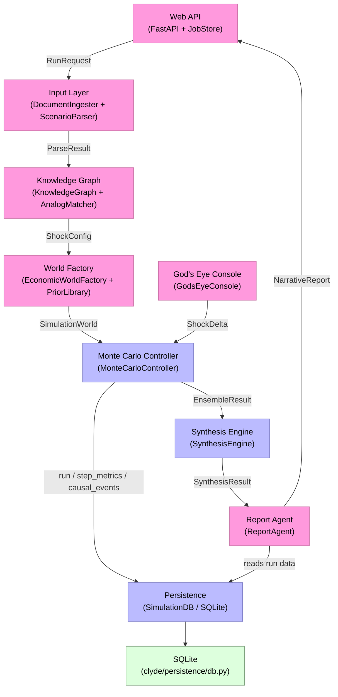
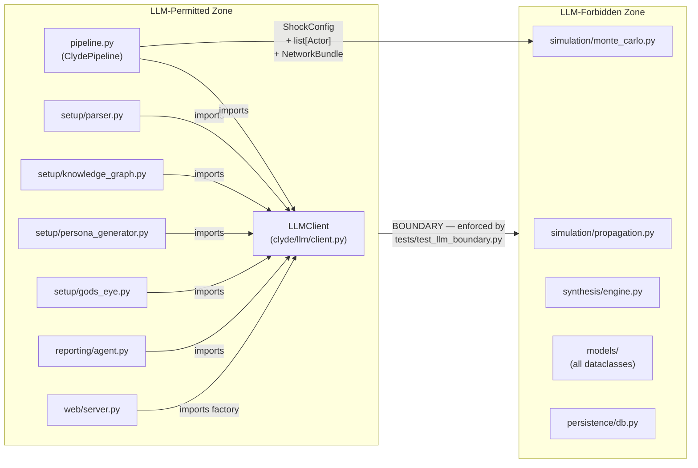
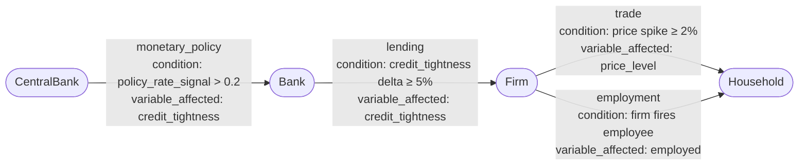

# Clyde


> Situation-agnostic economic simulator. Describe an event in plain English; get distributional outcomes with traceable causal chains.

```
   ____ _           _
  / ___| |_   _  __| | ___
 | |   | | | | |/ _` |/ _ \
 | |___| | |_| | (_| |  __/
  \____|_|\__, |\__,_|\___|
          |___/
```

[](#development) [](#) [](#) [](https://github.com/dheeraj7000/Clyde-v1)

**Repository:** https://github.com/dheeraj7000/Clyde-v1

---

## What is Clyde?

Clyde is a **situation-agnostic economic simulator**. You describe any economic event, policy, or shock in natural language — a Fed rate hike, a regional drought, a supply-chain disruption, a payroll-tax change — and Clyde builds a causal model of the affected actors and incentives, runs an ensemble of Monte Carlo simulations, and explains how the effects propagate.

The output is **distributional, not point-forecast**: central, optimistic, pessimistic, and tail paths, plus a divergence map showing which variables most drive uncertainty and which leading indicators to watch. Every claim in the report traces back to simulation data — no LLM hallucination in outputs. This is enforced architecturally: the simulation phase is strictly rule-based and has no LLM imports. The LLM is used only at setup (parsing the scenario, building the knowledge graph, spawning actors) and at reporting (narrative polish over evidence-only facts).

Behavioral parameters are drawn from a citable **prior library** (published elasticities, central-bank papers, peer-reviewed studies). Users can also fork **branches** at any step via natural-language injections in the God's Eye Console ("cut rates by 75bp at step 2") and compare alternate futures side-by-side.

---

## Architecture

### System Overview

Clyde is organized into seven top-level subsystems that form a linear pipeline from raw input to narrative report. LLM-powered subsystems are highlighted in pink; rule-based subsystems in blue. The God's Eye Console sits outside the main pipeline as a branching path.



### End-to-End Pipeline Data Flow

`ClydePipeline.run()` sequences ten discrete steps from raw input to narrative report. Steps 8 and 9 are strictly LLM-free. Step 5 (analog matching) is conditional on `PipelineConfig.use_analogs`.

```mermaid
flowchart LR
    classDef llmfree fill:#bbf,stroke:#88c,color:#000
    classDef llmpowered fill:#f9d,stroke:#c7a,color:#000

    S1["1 · Document Ingestion\ningest_many"]
    S2["2 · Scenario Parsing\nparse"]
    S3["3 · Knowledge Graph Build\nbuild_from_documents"]
    S4["4 · ShockConfig Extraction\nextract_shock_config"]
    USE_ANALOGS{"use_analogs?"}
    S5["5 · Analog Matching\nmatch"]
    S6["6 · World Building\nbuild_scenario"]
    S7["7 · Persona Generation\ngenerate_personas"]
    S8["8 · Monte Carlo Ensemble\nrun_ensemble\n⬡ LLM-free"]
    S9["9 · Synthesis\ncompute_paths\n⬡ LLM-free"]
    S10["10 · Report Generation\ngenerate_report"]

    S1 -->|"list[Document]"| S2
    S2 -->|"ParseResult"| S3
    S3 -->|"KnowledgeGraph"| S4
    S4 -->|"ShockConfig"| USE_ANALOGS
    USE_ANALOGS -->|"yes"| S5
    S5 -->|"ShockConfig + list[HistoricalAnalog]"| S6
    USE_ANALOGS -->|"no"| S6
    S6 -->|"SimulationWorld"| S7
    S7 -->|"list[ActorPersona]"| S8
    S8 -->|"EnsembleResult"| S9
    S9 -->|"SynthesisResult"| S10
    S10 -->|"NarrativeReport"| END(["PipelineResult"])

    class S8 llmfree
    class S9 llmfree
    class S1 llmpowered
    class S2 llmpowered
    class S3 llmpowered
    class S4 llmpowered
    class S5 llmpowered
    class S6 llmpowered
    class S7 llmpowered
    class S10 llmpowered
```



### LLM Boundary

The headline invariant: modules inside `clyde/simulation/`, `clyde/synthesis/`, `clyde/models/`, and `clyde/persistence/` are permanently forbidden from importing `clyde/llm/` or any LLM SDK. Enforced statically by `tests/test_llm_boundary.py`.



### Causal Event Propagation Channels

Four channels carry shocks through the actor network. After the ensemble, `SynthesisEngine.detect_causal_chains()` collapses thousands of raw events into canonical `CausalChain` records.



> Full architecture diagrams (14 total) including Monte Carlo flow, Actor model, Network topology, SQLite schema, God's Eye branching, and more: [`docs/diagrams.md`](docs/diagrams.md)

---

## Quickstart

```bash
git clone https://github.com/dheeraj7000/Clyde-v1.git clyde && cd clyde
pip install -e .[web]
```

Get an API key from one of:

- **OpenRouter** (recommended, single key fronts dozens of models): https://openrouter.ai/keys
- **Cerebras** (optional, fast inference): https://cloud.cerebras.ai

…or skip both and run in **Demo Mode** (`MockLLMClient`, no key needed).

```bash
cp .env.example .env
# edit .env, paste your key
export $(cat .env | xargs)

python -m clyde.web
# → open http://localhost:8000
```

Type a scenario into the input box ("A 50bp Fed rate hike in 2026 affecting US markets."), hit **Run**, and watch the ensemble play out.

---

## LLM Providers

Clyde auto-detects which provider to use based on env vars (resolution order: explicit `CLYDE_LLM_PROVIDER` → `OPENROUTER_API_KEY` → `CEREBRAS_API_KEY` → mock).

### OpenRouter (recommended)

A single key fronts dozens of upstream models. Set `OPENROUTER_API_KEY` and Clyde will use it automatically.

| Setting       | Default                             | Notes                          |
|---------------|-------------------------------------|--------------------------------|
| Model         | `anthropic/claude-3.5-sonnet`       | Override via `CLYDE_MODEL`     |
| Cheap option  | `anthropic/claude-3.5-haiku`        | ~10x cheaper, still solid JSON |
| Free option   | `meta-llama/llama-3.3-70b-instruct` | Free tier on OpenRouter        |

### Cerebras (optional, fast inference)

Cerebras is fast — useful when iterating on scenarios live during a demo.

| Setting | Default       | Notes                               |
|---------|---------------|-------------------------------------|
| Model   | `llama3.1-8b` | Override via `CLYDE_CEREBRAS_MODEL` |

Force this provider with `CLYDE_LLM_PROVIDER=cerebras`.

### Demo Mode

If neither key is set, Clyde falls back to `MockLLMClient`. The full pipeline runs end-to-end with deterministic stub responses. The web UI shows a banner indicating Demo Mode.

---

## Programmatic Use

```python
import asyncio
from clyde.llm import make_llm_client
from clyde.pipeline import Pipeline, PipelineConfig

async def main():
    pipeline = Pipeline(
        llm_client=make_llm_client(),
        config=PipelineConfig(run_count=50, ensemble_seed=0),
    )
    result = await pipeline.run("A 50bp Fed rate hike in 2026 affecting US markets.")
    print(result.scenario_id, len(result.report.sections), "sections")

    branch = await pipeline.fork_branch(result, "Cut rates by 75bp at step 2.")
    print(branch.branch_id, "vs", result.scenario_id)

asyncio.run(main())
```

A runnable version lives at [`examples/run_pipeline.py`](examples/run_pipeline.py).

---

## CLI

| Command               | What it does                                      |
|-----------------------|---------------------------------------------------|
| `clyde-web`           | Start the FastAPI server (defaults: 0.0.0.0:8000) |
| `python -m clyde.web` | Equivalent module form                            |

---

## REST API

| Method | Path                                            | Description                                             |
|--------|-------------------------------------------------|---------------------------------------------------------|
| GET    | `/`                                             | Frontend HTML bundle                                    |
| GET    | `/api/health`                                   | `{ status, provider, providers_available, model }`      |
| POST   | `/api/runs`                                     | Kick off a run; returns `{ job_id, status }`            |
| GET    | `/api/runs/{job_id}`                            | Poll: `{ status, progress, result?, error? }`           |
| POST   | `/api/runs/{job_id}/branches`                   | Fork a branch with a natural-language injection         |
| GET    | `/api/runs/{job_id}/branches/{branch_id}`       | Poll a branch                                           |
| GET    | `/api/scenarios/sample`                         | Demo scenarios for the UI                               |
| POST   | `/api/runs/{job_id}/agent-sim/start`            | Start an agent-based simulation from a completed run    |
| POST   | `/api/runs/{job_id}/agent-sim/{sim_id}/round`   | Execute one round of the agent simulation               |
| POST   | `/api/runs/{job_id}/agent-sim/{sim_id}/inject`  | Inject a mid-simulation event (God's Eye live)          |
| GET    | `/api/runs/{job_id}/agent-sim/{sim_id}/state`   | Get current state of an agent simulation                |

---

## Architecture Invariants

The headline invariant is the **LLM-vs-rule-based split**:

- `clyde/llm/`, `clyde/setup/`, `clyde/reporting/` — may import an LLM client.
- `clyde/simulation/`, `clyde/synthesis/` — must not. Ever.

Enforced two ways:

1. **Static import analysis** at test time (`tests/test_llm_boundary.py`) walks the AST of every module under `clyde/simulation/` and fails if any import path resolves into `clyde.llm`.
2. **Runtime contract tests** assert that `MonteCarloController` and `PropagationEngine` produce identical outputs given identical seeds, with no LLM client constructed.

---

## Development

```bash
pip install -e .[dev]
pytest
```

The project ships with **196+ passing tests** covering ingestion, parsing, knowledge-graph construction, world-factory determinism, Monte Carlo reproducibility, synthesis percentile bands, divergence maps, causal-chain detection, evidence-only reporting, and branch forking.

### Project Layout

```
clyde/
  llm/           OpenRouter, Cerebras, Mock clients + factory
  models/        Dataclasses (ShockConfig, Actor, StepMetrics, …)
  setup/         Document ingestion, scenario parser, knowledge graph,
                 economic world factory, prior library, God's Eye console,
                 persona generator, agent-based simulation engine
  simulation/    Monte Carlo controller, propagation engine (rule-based)
  synthesis/     Percentile bands, divergence map, causal chains
  reporting/     ReACT report agent (evidence-only)
  persistence/   SQLite store for trajectories + causal events
  web/           FastAPI server, job store + background runners, static frontend
  pipeline.py    End-to-end orchestrator (ClydePipeline)
tests/           pytest suite (~196 tests)
examples/        Runnable demos
docs/
  diagrams.md    Full architecture diagrams (14 Mermaid diagrams)
```

---

## License / Credits

TBD.
