# Clyde Economic Simulator — Architecture Diagrams

> **How to render:** These diagrams use [Mermaid](https://mermaid.js.org/) syntax and render automatically in:
> - **GitHub** — natively in any `.md` file preview
> - **VS Code** — with the [Mermaid Preview](https://marketplace.visualstudio.com/items?itemName=bierner.markdown-mermaid) extension
> - **Browser** — paste any block into [mermaid.live](https://mermaid.live) for instant rendering

---

## Table of Contents

1. [System Architecture Overview](#system-architecture-overview)
2. [End-to-End Pipeline Data Flow](#end-to-end-pipeline-data-flow)
3. [LLM Boundary](#llm-boundary)
4. [Actor Model](#actor-model)
5. [Network Topology](#network-topology)
6. [Monte Carlo Simulation Flow](#monte-carlo-simulation-flow)
7. [Propagation Engine Step Sequence](#propagation-engine-step-sequence)
8. [Data Model Hierarchy](#data-model-hierarchy)
9. [SQLite Persistence Schema](#sqlite-persistence-schema)
10. [Knowledge Graph and Setup Phase](#knowledge-graph-and-setup-phase)
11. [God's Eye Branching](#gods-eye-branching)
12. [Synthesis and Reporting Pipeline](#synthesis-and-reporting-pipeline)
13. [Web API and Job Lifecycle](#web-api-and-job-lifecycle)
14. [Causal Event Propagation Channels](#causal-event-propagation-channels)

---

## System Architecture Overview

Clyde is organized into seven top-level subsystems that form a linear pipeline from raw input to narrative report, with two cross-cutting concerns layered on top: a Web API entry point that wraps the entire pipeline, and a SQLite persistence side-channel that the Monte Carlo Controller writes to and the Report Agent reads from. The diagram below uses fill color to distinguish LLM-powered subsystems (pink) — which may call `clyde/llm/` — from rule-based subsystems (blue) that are strictly LLM-free. The God's Eye Console sits outside the main pipeline as a branching path: it accepts a natural-language injection, produces a `ShockDelta`, and feeds it back into the Monte Carlo Controller to re-simulate from step 0.

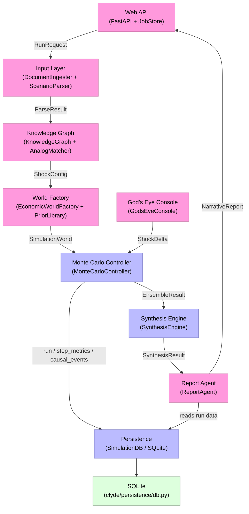

---

## End-to-End Pipeline Data Flow

`ClydePipeline.run()` sequences ten discrete steps from raw input to narrative report. Each step is owned by a single subsystem and passes a typed artifact to the next. Steps 8 and 9 — the Monte Carlo ensemble and the synthesis aggregation — are strictly LLM-free: they operate on fully-resolved `ShockConfig` and `SimulationWorld` objects and never call `clyde/llm/`. Step 5 (analog matching) is conditional: it runs only when `PipelineConfig.use_analogs=True` and an `AnalogMatcher` is present; when skipped, `ShockConfig` flows directly from step 4 to step 6 with an empty `historical_analogs` list.

```mermaid
flowchart LR
    classDef llmfree fill:#bbf,stroke:#88c,color:#000
    classDef llmpowered fill:#f9d,stroke:#c7a,color:#000

    S1["1 · Document Ingestion\ningest_many"]
    S2["2 · Scenario Parsing\nparse"]
    S3["3 · Knowledge Graph Build\nbuild_from_documents"]
    S4["4 · ShockConfig Extraction\nextract_shock_config"]
    USE_ANALOGS{"use_analogs?"}
    S5["5 · Analog Matching\nmatch"]
    S6["6 · World Building\nbuild_scenario"]
    S7["7 · Persona Generation\ngenerate_personas"]
    S8["8 · Monte Carlo Ensemble\nrun_ensemble\n⬡ LLM-free"]
    S9["9 · Synthesis\ncompute_paths\n⬡ LLM-free"]
    S10["10 · Report Generation\ngenerate_report"]

    S1 -->|"list[Document]"| S2
    S2 -->|"ParseResult"| S3
    S3 -->|"KnowledgeGraph"| S4
    S4 -->|"ShockConfig"| USE_ANALOGS
    USE_ANALOGS -->|"yes"| S5
    S5 -->|"ShockConfig + list[HistoricalAnalog]"| S6
    USE_ANALOGS -->|"no"| S6
    S6 -->|"SimulationWorld"| S7
    S7 -->|"list[ActorPersona]"| S8
    S8 -->|"EnsembleResult"| S9
    S9 -->|"SynthesisResult"| S10
    S10 -->|"NarrativeReport"| END(["PipelineResult"])

    class S8 llmfree
    class S9 llmfree
    class S1 llmpowered
    class S2 llmpowered
    class S3 llmpowered
    class S4 llmpowered
    class S5 llmpowered
    class S6 llmpowered
    class S7 llmpowered
    class S10 llmpowered
```

---

## LLM Boundary

The LLM boundary is the most critical architectural invariant in Clyde: modules inside `clyde/simulation/`, `clyde/synthesis/`, `clyde/models/`, and `clyde/persistence/` are permanently forbidden from importing anything in `clyde/llm/` or any third-party LLM provider SDK. This keeps the simulation deterministic, auditable, and free of network calls during the compute-intensive ensemble phase. The boundary is enforced statically by `tests/test_llm_boundary.py`, which walks the AST of every file under `clyde/simulation/` and fails the build if a forbidden import is found. The handoff across the boundary is a fully-resolved triple — `ShockConfig`, `list[Actor]`, and `NetworkBundle` — that carries all behavioral parameters the simulation needs without any further LLM involvement.

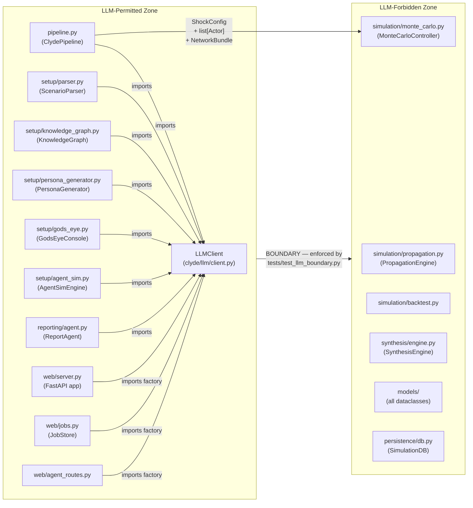

---

## Actor Model

Every simulation agent is an `Actor` instance carrying a type discriminator (`actor_type`), a typed params object frozen at construction time, a mutable state dict updated each step, and a list of `Relationship` edges to other actors. The four concrete params classes (`HouseholdParams`, `FirmParams`, `BankParams`, `CentralBankParams`) encode the behavioral elasticities drawn from the `PriorLibrary`; the four state classes hold the runtime variables written by the `PropagationEngine` each tick. The `Relationship` dataclass represents a directed, weighted edge between two actors with a validated `rel_type` drawn from the `RELATIONSHIP_TYPES` frozenset. The diagrams below are split into params classes and state classes for readability.

### Actor Base, Params Classes, Relationship, and ActorType

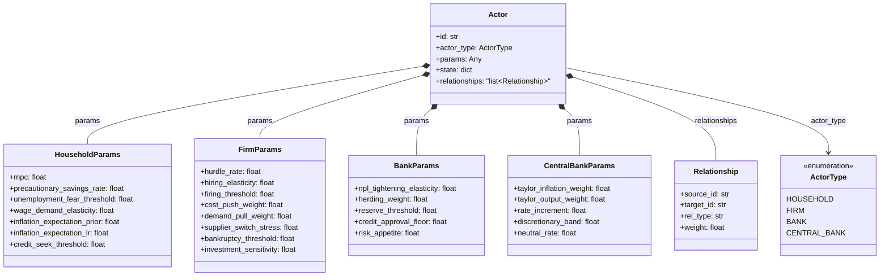

### State Classes

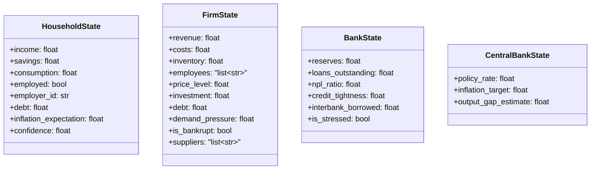

---

## Network Topology

The three networks inside a `NetworkBundle` are the wiring layer that turns a flat list of `Actor` objects into an interacting economy. Each network enforces a strict topology constraint: the labor market (`BipartiteGraph`) only connects households to firms, the supply chain (`DirectedGraph`) carries directed firm-to-firm and firm-to-household edges, and the interbank network (`ScaleFreeGraph`) is bank-to-bank only, grown via Barabási–Albert preferential attachment. Every edge in each network maps to a named relationship type (`employment`, `supply`, `trade`, or `lending`) that the `PropagationEngine` reads when propagating shocks. The `NetworkBundle` aggregator holds all three graphs and is the single object handed across the LLM boundary into the simulation phase.

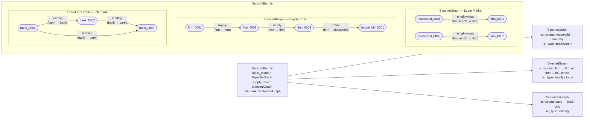

---

## Monte Carlo Simulation Flow

`MonteCarloController.run_ensemble()` turns a single `SimulationWorld` into a statistically robust `EnsembleResult` by running hundreds of deterministically seeded, independently jittered trajectories. The flow begins with Knuth-multiplicative seed derivation — each per-run seed is produced by multiplying the ensemble seed by the golden-ratio constant `2654435761`, XOR-ing with the run index, and masking to 32 bits, with collision re-derivation via a large-prime bump. Each seed then drives `_jitter_world_impl`, which perturbs actor params across four axes: behavioral response strength (multiplicative noise on every numeric param), timing (additive offset on firm hiring/firing thresholds), shock severity (clamped multiplicative noise on `ShockConfig.severity`), and contagion thresholds (bank `reserve_threshold` and `credit_approval_floor` are part of the multiplicative pass). The jittered world is dispatched to a `ProcessPoolExecutor` worker pool; if the pool breaks or `parallel=False` is set, execution falls back to a serial loop in the orchestrator process. Each worker calls `PropagationEngine.run()` and returns a `TrajectoryResult`; failed workers are logged and warned about but do not abort the ensemble. Successful trajectories are aggregated into an `EnsembleResult`. When a `SimulationDB` handle is supplied, the orchestrator process (never the worker) writes each run record, its step metrics batch, and its causal events to SQLite — keeping the non-picklable DB connection safely out of the process pool.

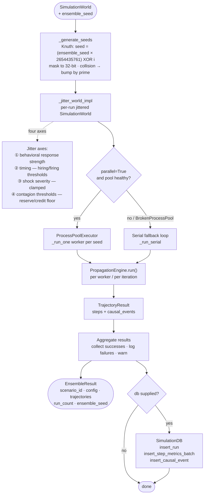

---

## Propagation Engine Step Sequence

`PropagationEngine._step()` executes nine actor-update phases in strict order every simulation tick. Before phase 1 runs at step 0, a pre-phase applies the raw shock severity directly to each `initial_contact_actors` entry — this is the only hardcoded injection point; all downstream effects must be network-mediated. Phases 2 and 3 are the primary `CausalEvent` emitters: phase 2 fires a `monetary_policy` event when the central-bank policy-rate signal exceeds 0.2 and a `lending` event when a bank's `credit_tightness` rises by ≥ 5%; phase 3 fires a `trade` event when a firm's price level jumps ≥ 2%; phases 4 and 7 fire `employment` events when a firm fires a worker or goes bankrupt. Phase 9 computes the nine core `StepMetrics` — including `observed_inflation` and `output_gap_estimate` — which the central bank reads at the start of the next tick to update its Taylor-rule rate, closing the feedback loop from phase 9 back to phase 1.

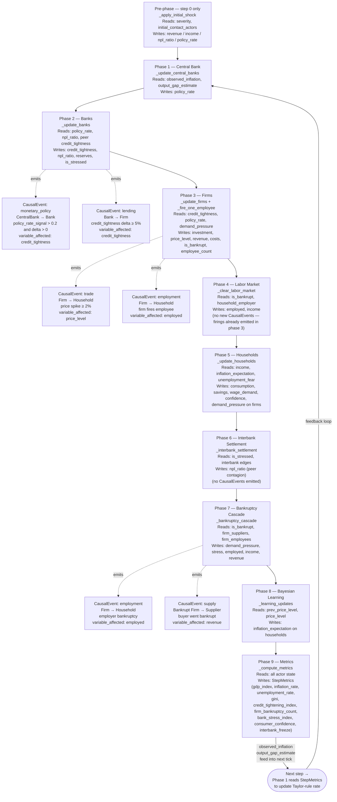

---

## Data Model Hierarchy

The sixteen core dataclasses form three loosely coupled clusters. The **input/config cluster** (`TimeHorizon`, `HistoricalAnalog`, `ShockConfig`, `ShockDelta`, `SimulationWorld`, `Scenario`) carries everything needed to initialise and fork a simulation run. The **simulation output cluster** (`StepMetrics`, `CausalEvent`, `TrajectoryResult`, `EnsembleResult`) holds the raw per-step and per-run results produced by the `PropagationEngine` and `MonteCarloController`. The **synthesis/reporting cluster** (`PathBundle`, `CausalChain`, `DivergenceVariable`, `DivergenceMap`, `SynthesisResult`, `NarrativeReport`) holds the aggregated, human-readable outputs produced by `SynthesisEngine` and `ReportAgent`. Composition arrows (`*--`) indicate that the parent owns and serialises the child; aggregation arrows (`o--`) indicate that the parent holds a reference list but the child objects are also meaningful on their own.

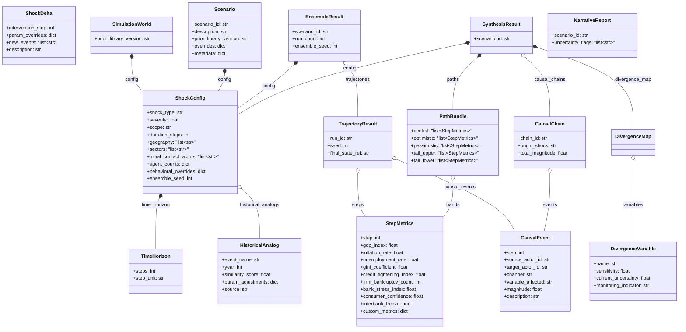

---

## SQLite Persistence Schema

The five SQLite tables form two distinct relationship clusters. The `runs` table is the central hub: both `step_metrics` and `causal_events` hang off it via `run_id` foreign keys, giving each run a full time-series of economic metrics and a complete log of actor-to-actor shock transmissions. The `branches` table is intentionally decoupled — it references a `parent_scenario_id` (a scenario identifier, not a run identifier) because a branch is a re-simulation of an entire scenario under a modified `ShockConfig`, not a continuation of a specific run. The `backtest_results` table is similarly standalone, keyed by `scenario_id` to allow multiple historical comparisons per scenario. All JSON columns (`config_json`, `custom_metrics_json`, `shock_delta_json`, `merged_config_json`, `actual_outcome_json`, `simulated_distribution_json`) store serialized dataclass payloads that are deserialized by `SimulationDB` read methods before being returned to callers.

```mermaid
erDiagram
    runs {
        TEXT run_id PK "UUID for this simulation run"
        TEXT scenario_id "Scenario this run belongs to"
        TEXT branch_id "NULL for baseline runs"
        INTEGER seed "Deterministic RNG seed"
        TEXT config_json "Serialized ShockConfig"
        TEXT status "running | completed | failed"
        TIMESTAMP created_at "Row creation time"
    }

    step_metrics {
        TEXT run_id PK FK "References runs.run_id"
        INTEGER step PK "Simulation tick (0-based)"
        REAL gdp_index "GDP index value"
        REAL inflation_rate "Observed inflation rate"
        REAL unemployment_rate "Unemployment rate"
        REAL gini_coefficient "Income inequality measure"
        REAL credit_tightening_index "Credit tightness 0-1"
        INTEGER firm_bankruptcy_count "Bankrupt firms this step"
        REAL bank_stress_index "Bank stress 0-1"
        REAL consumer_confidence "Consumer confidence 0-1"
        INTEGER interbank_freeze "1 if interbank frozen else 0"
        TEXT custom_metrics_json "Extra metrics as JSON dict"
    }

    causal_events {
        INTEGER event_id PK "Auto-increment surrogate key"
        TEXT run_id FK "References runs.run_id"
        INTEGER step "Simulation tick when event fired"
        TEXT source_actor_id "Originating actor ID"
        TEXT target_actor_id "Receiving actor ID"
        TEXT channel "monetary_policy|lending|trade|employment|supply"
        TEXT variable_affected "State variable changed"
        REAL magnitude "Signed shock magnitude"
        TEXT description "Human-readable event summary"
    }

    branches {
        TEXT branch_id PK "UUID for this branch"
        TEXT parent_scenario_id "Scenario that was forked"
        TEXT shock_delta_json "Serialized ShockDelta override"
        TEXT merged_config_json "Serialized merged ShockConfig"
        TIMESTAMP created_at "Row creation time"
    }

    backtest_results {
        TEXT backtest_id PK "UUID for this backtest"
        TEXT scenario_id "Scenario being validated"
        TEXT historical_event "Name of historical reference event"
        TEXT actual_outcome_json "Observed historical outcome"
        TEXT simulated_distribution_json "Simulated outcome distribution"
        REAL accuracy_score "Comparison score (nullable)"
        TIMESTAMP created_at "Row creation time"
    }

    runs ||--o{ step_metrics : "has many steps"
    runs ||--o{ causal_events : "has many events"
```

---

## Knowledge Graph and Setup Phase

The setup phase transforms two heterogeneous input streams — raw documents (PDF, Markdown, plain text) and a natural-language scenario description — into a fully resolved `ShockConfig` and `SimulationWorld` ready for the simulation engine. `DocumentIngester.ingest_many` loads files into `Document` objects while `ScenarioParser.parse` converts the NL description into a structured `ParseResult`; both streams converge at `KnowledgeGraph.build_from_documents`, which calls the LLM once per document to extract entities and relations. The `merge_sources()` step reconciles NL-derived and document-derived entities by id: any field-level disagreement is recorded as a `Conflict` and the entity is withheld until the user resolves it. `extract_shock_config()` then assembles a `ShockConfig` from the merged graph and the `ParseResult`, extending geography and sector lists from every matching graph entity. `EconomicWorldFactory._build()` takes that config through five deterministic steps: spawn actors from `PriorLibrary` empirical priors, validate and apply behavioral overrides, wire the three networks via `NetworkBuilder`, attach per-actor `Relationship` lists from network edges, and cross-validate every relationship. Finally, `AnalogMatcher.match()` is an optional enrichment step — when `use_analogs=True`, it scores the `ShockConfig` against a curated corpus of historical events and appends the top-k `HistoricalAnalog` records to the config before it crosses the LLM boundary into the simulation phase.

```mermaid
flowchart LR
    RAW_DOCS(["Raw Documents\nPDF / MD / TXT"])
    NL_DESC(["NL Scenario Description"])

    INGESTER["DocumentIngester\ningest_many\n→ list[Document]"]
    PARSER["ScenarioParser\nparse\n→ ParseResult"]

    KG["KnowledgeGraph\nbuild_from_documents\n(LLM: one call per document)"]

    MERGE["merge_sources()\nNL entities vs doc entities\nConflict → withheld until resolved"]

    EXTRACT["extract_shock_config()\nParseResult + graph entities\n→ ShockConfig"]

    ANALOG_CHECK{"use_analogs?"}

    ANALOG["AnalogMatcher\nmatch(shock_config)\nscores corpus · top-k\n→ list[HistoricalAnalog]\nappended to ShockConfig"]

    PRIOR["PriorLibrary\nget_params(actor_type)\nversioned empirical priors"]

    FACTORY["EconomicWorldFactory\n_build()"]

    SPAWN["① Spawn actors\nfrom PriorLibrary priors\nper agent_counts in ShockConfig"]

    OVERRIDES["② Apply overrides\nbehavioral_overrides + param_overrides\nper-id beats per-type"]

    NETWORKS["③ Build networks\nNetworkBuilder\nlabor_market · supply_chain · interbank"]

    ATTACH["④ Attach relationships\nemployment · supply · trade · lending\nfrom network edges"]

    VALIDATE["⑤ Validate\ncross-check all rel source/target ids\nand rel_type values"]

    WORLD(["SimulationWorld\nconfig · actors · networks\nprior_library_version"])

    RAW_DOCS --> INGESTER
    NL_DESC --> PARSER
    INGESTER -->|"list[Document]"| KG
    PARSER -->|"ParseResult"| KG
    KG --> MERGE
    MERGE -->|"merged entities + relations"| EXTRACT
    PARSER -->|"ParseResult"| EXTRACT
    EXTRACT -->|"ShockConfig"| ANALOG_CHECK
    ANALOG_CHECK -->|"yes"| ANALOG
    ANALOG -->|"ShockConfig + HistoricalAnalogs"| FACTORY
    ANALOG_CHECK -->|"no"| FACTORY
    PRIOR -->|"typed params"| SPAWN
    FACTORY --> SPAWN
    SPAWN --> OVERRIDES
    OVERRIDES --> NETWORKS
    NETWORKS --> ATTACH
    ATTACH --> VALIDATE
    VALIDATE --> WORLD
```

---

## God's Eye Branching

The God's Eye Console is the only mechanism that lets an analyst fork a live scenario mid-timeline without touching the running simulation state. The lifecycle begins when `ClydePipeline.fork_branch()` receives a natural-language injection string and passes it — together with a serialized snapshot of the base `Scenario` — to `GodsEyeConsole.parse_injection()`. The console sends a structured prompt to the LLM and retries up to `max_retries` times with exponential backoff; on success it builds a `ShockDelta` from the JSON response. Any ambiguities the LLM could not resolve (or that fail range validation, such as an out-of-range `intervention_step`) are stashed under the magic key `AMBIGUITY_KEY` (`"_ambiguities"`) inside `ShockDelta.param_overrides` so callers can surface a UI prompt — the key is stripped before the delta is merged so it never pollutes a runnable `ShockConfig`. `MonteCarloController.merge_delta()` then applies the delta to the base config using two promotion rules: top-level fields (`severity`, `duration_steps`, `shock_type`, `scope`) found in `param_overrides` replace the corresponding `ShockConfig` fields directly, while all remaining keys are merged into `behavioral_overrides` with delta winning on conflict. The merged config drives a fresh `run_ensemble()` call from step 0 — never mutating any running simulation state — and the resulting `BranchResult` (carrying `branch_id`, `parent_scenario_id`, `delta`, `merged_config`, and `ensemble`) is appended to `PipelineResult.branches` and persisted via `SimulationDB.insert_branch()`.

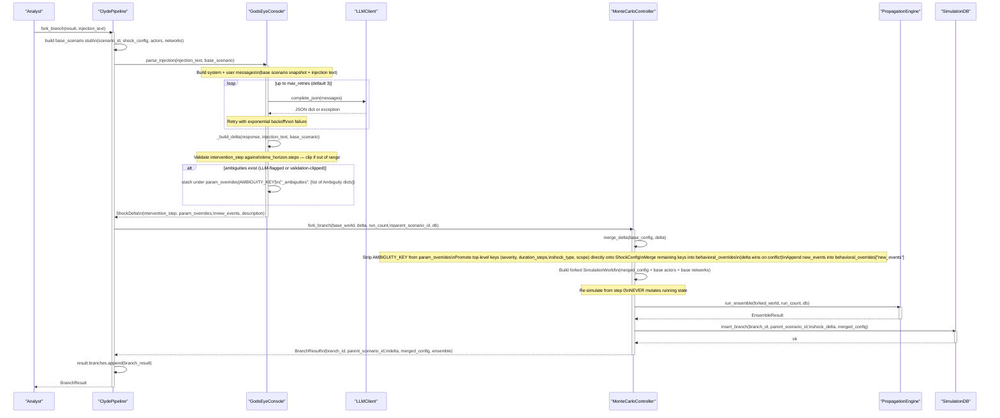

---

## Synthesis and Reporting Pipeline

The synthesis and reporting pipeline is the final, fully deterministic stage of Clyde's processing chain — with one narrow, clearly annotated exception. `SynthesisEngine` (LLM-free) runs four operations in sequence on the raw `EnsembleResult`: `compute_paths()` collapses all trajectories into five percentile bands (p03/p10/p50/p90/p97) per metric per step, inverting the band assignment for "lower is better" metrics so that `optimistic` always means the best outcome regardless of direction; `compute_divergence_map()` ranks metrics by cross-trajectory variance to surface the top drivers of outcome uncertainty; `detect_causal_chains()` groups per-trajectory `CausalEvent` sequences by their (source, target, channel) signature and deduplicates them into canonical `CausalChain` records; and `select_metrics()` combines divergence-map variables with the metrics showing the largest end-to-end delta in the central path. `ReportAgent.generate_report()` then consumes the resulting `SynthesisResult` in five steps: it first detects uncertainty flags programmatically from the `ShockConfig` and `PathBundle` (scanning for keyword matches and tail-band dispersion), then builds four evidence-only section bodies — Outcome Range, Causal Pathways, Divergence and Watchlist, and Uncertainty Flags — each backed by `ProvenanceAnnotation` records. Only after all factual content is assembled does the agent make a single call to `_llm_polish()`, which asks the LLM to write decorative prose paragraphs without introducing any new numbers, names, or facts. This is the only LLM call in the entire synthesis and reporting pipeline.

```mermaid
flowchart LR
    ENSEMBLE(["EnsembleResult\ntrajectories · config · run_count"])

    subgraph SYNTH["SynthesisEngine — LLM-free"]
        CP["compute_paths()\nper step · per metric\nsort values across trajectories"]
        PCTILE["Percentile logic\np03 · p10 · p50 · p90 · p97\nhigher_is_better: opt=p90 · pes=p10 · tu=p97 · tl=p03\nlower_is_better: opt=p10 · pes=p90 · tu=p03 · tl=p97"]
        PB(["PathBundle\ncentral · optimistic · pessimistic\ntail_upper · tail_lower"])

        CDM["compute_divergence_map()\ncross-traj variance per metric\nCV at final step · rank top-k"]
        DM(["DivergenceMap\nvariables: name · sensitivity\nuncertainty · monitoring_indicator"])

        DCC["detect_causal_chains()\ngroup by (source, target, channel) signature\ndeduplicate · sort by frequency"]
        CC(["list[CausalChain]\nchain_id · origin_shock\nevents · total_magnitude"])

        SM["select_metrics()\ndivergence-map vars\n+ top-3 end-to-end delta metrics"]
        MS(["list[MetricSelection]\nmetric · reason"])
    end

    subgraph REPORT["ReportAgent.generate_report()"]
        FLAGS["detect_uncertainty_flags()\nkeyword scan on shock_type · geography · overrides\n+ tail-band dispersion check"]
        FLAG_LIST(["Uncertainty flags detected\nunknown_regime\nreflexivity_risk\nheavy_tail_dynamics\nexogenous_geopolitical\nhigh_outcome_dispersion"])

        S1["_build_outcome_range_section()\nband summaries at horizon\nreflexivity: pre/post split\nheavy-tail softening · unknown-regime widening"]
        S2["_build_causal_pathways_section()\nchain-by-chain event listing\nstep · source → target · channel · magnitude"]
        S3["_build_divergence_section()\ntop divergence drivers\nsensitivity · uncertainty · monitoring indicator"]
        S4["_build_uncertainty_section()\nlist fired flags with provenance"]

        POLISH["_llm_polish()\n⚠ ONLY LLM CALL in this pipeline\nwrites decorative prose paragraphs\nDO NOT introduce new facts · numbers · names"]

        NR(["NarrativeReport\nscenario_id · sections\nprovenance · uncertainty_flags"])
    end

    ENSEMBLE --> CP
    CP -. "percentile logic" .-> PCTILE
    CP --> PB
    PB --> CDM
    CDM --> DM
    DM --> DCC
    DCC --> CC
    CC --> SM
    SM --> MS

    MS --> FLAGS
    PB --> FLAGS
    FLAGS --> FLAG_LIST
    FLAG_LIST --> S1
    FLAG_LIST --> S2
    FLAG_LIST --> S3
    FLAG_LIST --> S4
    PB --> S1
    CC --> S2
    DM --> S3

    S1 --> POLISH
    S2 --> POLISH
    S3 --> POLISH
    S4 --> POLISH
    POLISH --> NR
```

---

## Web API and Job Lifecycle

The web layer is a thin FastAPI application that wraps the entire pipeline behind an async job queue. Every `POST /api/runs` request creates a `Job` in the `JobStore`, spawns an `asyncio.Task` that drives `run_pipeline_job()`, and immediately returns a `job_id` for polling. Progress advances through five coarse stages — `parsing`, `building world`, `running ensemble`, `synthesizing`, and `generating report` — before landing in `completed` or `failed`. Branch runs follow the same pattern: `POST /api/runs/{job_id}/branches` creates a `BranchJob` (a child of the parent `Job`) and spawns a second task that calls `run_branch_job()`. The `PipelineFactory` callable is the single injection point that lets tests substitute a stub pipeline without touching any route logic — the server checks `app.state.pipeline_factory_override` first and falls back to the real LLM-backed factory. The four agent-sim endpoints (`/agent-sim/start`, `/agent-sim/{sim_id}/round`, `/agent-sim/{sim_id}/inject`, `/agent-sim/{sim_id}/state`) operate on a per-job in-memory `agent_sim` dict and require the parent job to be in `completed` status before they can be called.

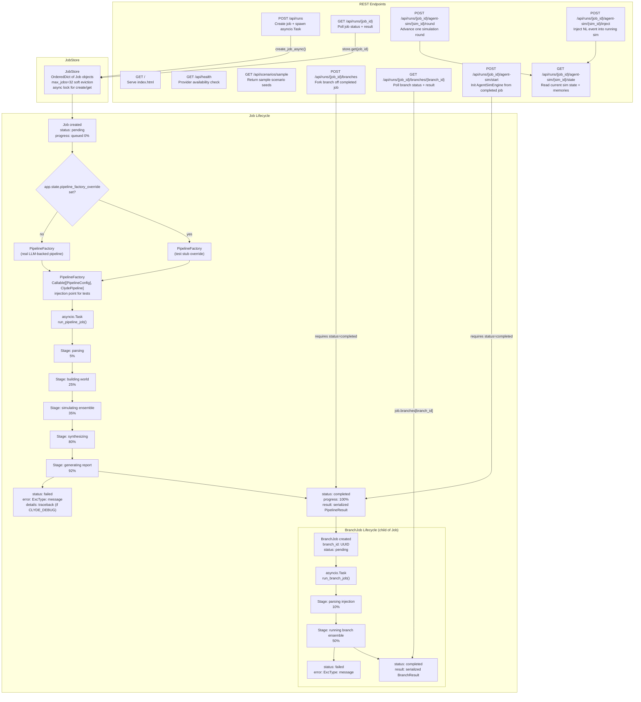

---

## Causal Event Propagation Channels

Every shock that propagates through the Clyde network is recorded as a `CausalEvent` — a typed, actor-to-actor transmission record carrying a channel name, the state variable it affects, and a signed magnitude. There are four channels, each emitted by a distinct phase of `PropagationEngine._step()`: `monetary_policy` fires in phase 2 when the central-bank policy-rate signal exceeds 0.2 and the bank's credit tightness is rising (CentralBank → Bank, `variable_affected: credit_tightness`); `lending` fires in phase 2 when a bank's credit tightness jumps by ≥ 5% in a single step (Bank → Firm, `variable_affected: credit_tightness`); `trade` fires in phase 3 when a firm's price level spikes by ≥ 2% (Firm → Household, `variable_affected: price_level`); and `employment` fires in phases 3 and 7 when a firm fires a worker or goes bankrupt (Firm → Household, `variable_affected: employed`). After the ensemble completes, `SynthesisEngine.detect_causal_chains()` collapses the per-trajectory `CausalEvent` streams into canonical `CausalChain` records by grouping on the (source, target, channel) signature tuple, deduplicating within each group, and sorting chains by cross-trajectory frequency — turning thousands of raw events into a compact, human-readable causal narrative.

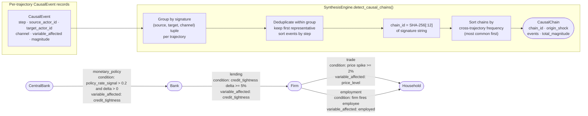
